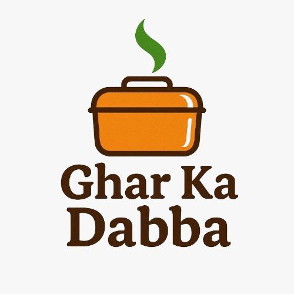

# <p align="center">🍱 घर का डब्बा — Ghar Ka Dabba 🍱</p>

<p align="center">
  
</p>

<p align="center">
  <strong>🔥 Premium Full-Stack Indian Homemade Tiffin Service Web Application 🔥</strong>
</p>

<p align="center">
  
  
  
  
  
</p>

<p align="center">
  
  
  
</p>

<hr />

## 🌟 Introduction

**Ghar Ka Dabba** ek premium aur modern full-stack web application hai jo elite homemade tiffin service provide karta hai. Isko **mom-approved health guidelines** aur modern startup UI models (jaise Zomato, Swiggy, aur Apple ke minimalist theme) se inspire hokar banaya gaya hai. 

Ye application pure homemade food aur busy professionals ke beech ke gap ko bridge karta hai. Ab ye pure **React (Vite)** aur **Node.js (Express)** backend backend system se powered hai.

---

## 🎨 Premium Visual Palette

| Accent Color | Hex Code | Visual Reference | Used For |
| :--- | :--- | :--- | :--- |
| **Brand Orange** | `#F97316` | 🟧 | Primary CTA, Highlights, Hover triggers |
| **Warm Cream** | `#FFF7ED` | 🟨 | Relaxed editorial background, cards base |
| **Deep Dark** | `#1F2937` | ⬛ | Title headers, body copy, structural grids |
| **Fresh Green** | `#16A34A` | 🟩 | Veg diet indicators, success notifications |

---

## 🚀 Key Highlights & Full-Stack UX Features

*   **⚡ Modern React SPA (Vite)**: Instantly fast transitions bina kisi screen reloads ke.
*   **📱 Universal Responsiveness**: Mobile, Tablet, Laptop aur Desktops par fully optimized layout.
*   **🛒 Zomato-Style Subscription Customizer**:
    *   **Diet Switcher**: Vegetarian aur Non-Vegetarian choices toggle options.
    *   **Portion Counter**: Live Roti counts adjustment (+ or -) state updates ke sath.
    *   **Estimated Price Calculator**: Custom features choose karte hi price automatic calculate hota hai.
*   **📨 Slide-Out Cart Panel**: Right side drawer jo configured plans, subtotal, aur Checkout options dikhata hai.
*   **🔑 Glassmorphic Auth System**: Login aur Account creation inputs jo backend API ke sath connect hain.
*   **🍜 Food Gallery Page**: Client-side routing ke sath **16 tasty food items** ki interactive dynamic grid.
*   **⚙️ Node.js Express API**: Server-side endpoints jo login registers, newsletter subscription aur subscription orders fetch karte hain.

---

## 📂 Code Repository Structure

```
ghar_ka_dabba/
├── frontend/                 # React Frontend Application (Vite)
│   ├── public/               # Favicon aur Static Images
│   └── src/
│       ├── components/       # Reusable components (Navbar, Footer, Modals, Cart)
│       ├── views/            # Route Views (HomeView, GalleryView)
│       ├── App.jsx           # Application state aur routing configuration
│       ├── index.css         # Consolidated CSS style sheet
│       └── main.jsx          # React app DOM mounting point
├── backend/                  # Node.js Express Server
│   ├── package.json          # Server configurations aur dependencies
│   └── server.js             # API routes logic (Auth, Bookings, Subscriptions)
├── package.json              # Workspace entry package.json
└── README.md                 # Project handbook
```

---

## 🔧 Local Installation Guide

Niche diye gaye steps ko follow karke fullstack setup ko local system me 2 minute me run kar sakte hain:

### 1. Project directory setup karein:
```bash
git clone https://github.com/iitdeveloper-git/ghar-ka-dabba.git
cd ghar-ka-dabba
```

### 2. Sabhi dependencies ko ek click me install karein:
```bash
npm run install-all
```

### 3. Server aur Frontend concurrently run karein:
```bash
npm run dev
```

### 4. Check karein:
Dono services start ho jayengi:
*   **Frontend Client**: [http://localhost:5173](http://localhost:5173)
*   **Express Backend API**: [http://localhost:5000](http://localhost:5000)

---

## 🤝 Creator Attribution

Developed with extreme precision and love by **[IIT-Developer](https://iitdeveloper.com/)**.

<p align="center">
  <em>Copyright © 2026 Ghar Ka Dabba. All Rights Reserved.</em>
</p>
